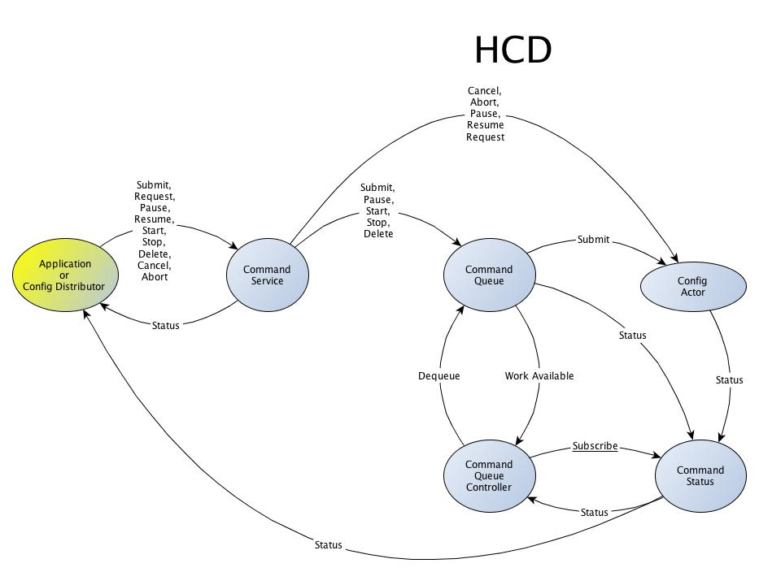
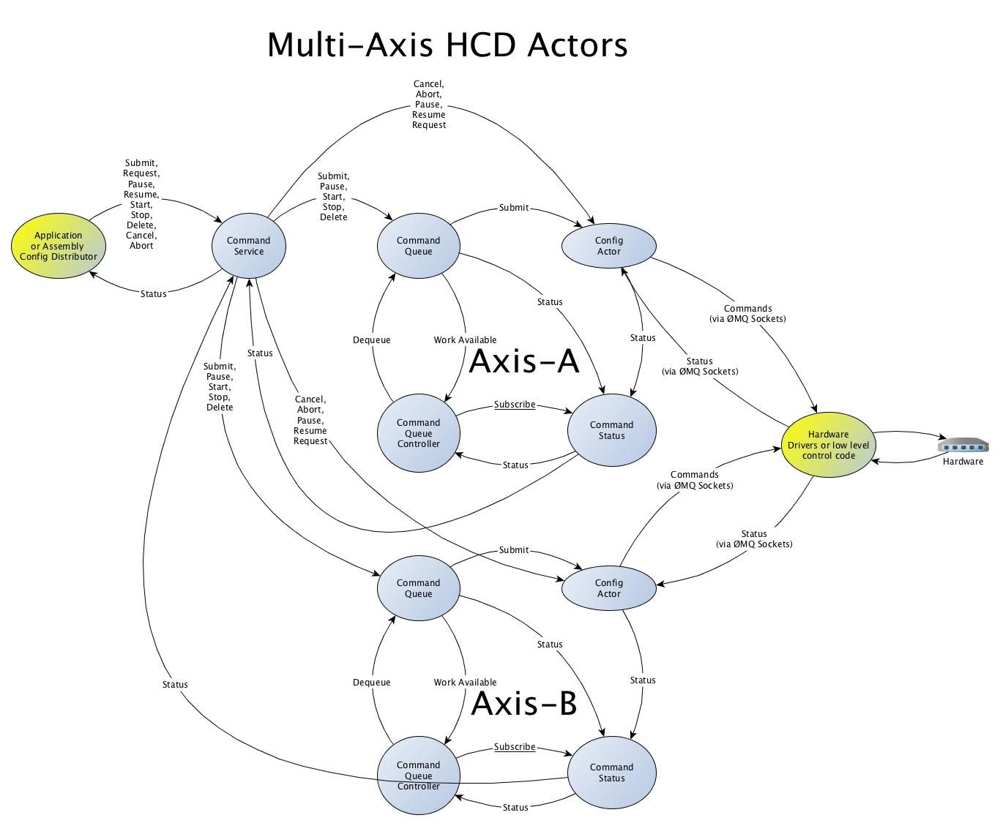
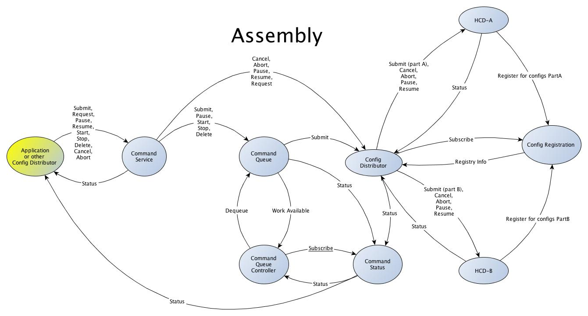

Command Service
=====================

This module implements the Command Service, which is used to send commands to actors.

Main Packages:
--------------

* akka - the Akka actor interface (based on core)
* core - the core classes (like the Configuration class)
* spray - The spray REST/HTTP interface

HCD (Hardware Control Daemon) View
----------------------------------

The command service actor receives a submit command with the config
(or other control commands) and passes it to the command queue actor.

The command queue actor tells the command queue controller actor that
there is work available.  This actor comes in various flavors so that
it can implement "one at a time" behavior or concurrent behavior. The
HCD or Assembly class can extend a trait that adds the correct queue
controller actor to the system. The queue controller actor also
receives command status info and uses that to decide when the next
config should be taken from the queue and passed to the "queue
client".  It does this by sending a "Dequeue" message to the queue
actor. The queue actor then sends the config to the queue client. In
the case of an HCD, the queue client is the config actor (For an
assembly it is the config distributor actor).

When the config actor receives the submit, it performs the work and
then sends the status to the command status actor.

The command status actor passes the status to subscribers (which
include the queue controller) and also to the original submitter of
the config (The sender is passed along with the submit message).

Multi-Axis HCDs
---------------

Some multi-axis HCDs can do multiple things at once, but each axis can
only do one thing at a time. For this case there is the MultiAxisCommandServiceActor
and the MultiAxisOneAtATimeCommandQueueController.

The actor graph for multi-axis HCDs is similar to the one for plain HCDs,
except that there is one copy of the
Command Queue, Command Queue Controller, Command Status and Config actors for each axis.
Also the multi-axis command service actor may need to intercept the command status for multiple axes
and return a single command status, if the original config accessed multiple axes at once, so that
the original sender gets single status values as expected.

Location Service
----------------

The location service is a single actor that runs once somewhere in the network.
All HCDs and assemblies send a registration message to the location service on startup.
The location service saves both the Akka and HTTP URIs of every HCD or assembly.
The Akka URI can be used to locate the actor and the HTTP URI points to the web service
for the actor, if available. Assemblies request information about the HCDs they want to
use and receive a single reply when all of the HCDs are available.
HCDs can also optionally specify which parts of config messages they should receive.

Assembly View
-------------

The assembly has the same basic actor setup, except that here the config
distributor actor is used in place of the config actor. An assembly requests
information about the HCDs it wants to use at startup and passes the answer
to the config distributor actor, so that it knows where to send which parts
of configs iot receives.

When a config is submitted to an assembly, it is passed to the command
queue actor, which eventually passes it to the config distributor actor. It
uses the location service info to pass parts of the config to the different
HCDs.  Later, the "command status actor" in each "HCD" sends the
command status to the config distributor actor (since it appears as
the original sender in the message sent to the HCDs). When all the
HCDs (or assemblies) involved are done, the final command status is
sent to the assembly's command status actor, which forwards it to the
subscribers and the original submitter.

