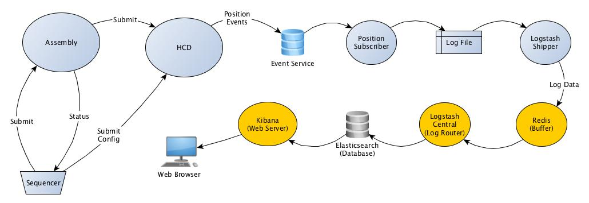

Log Service
===========

The Log Service package contains the config files for logging and optional, external applications
(Logstash, Elasticsearch, Kibana) to view and process the log information.

A special logger [PrefixedActorLogging](src/main/scala/csw/services/log/PrefixedActorLogging.scala) is 
provided for Akka actors that implement TMT components, such as HCDs and assemblies. 
It inserts an [MDC](http://logback.qos.ch/manual/mdc.html) prefix field into the log, where prefix 
is the component prefix, which is made up of the subsystem name, followed by a dot and the rest of the component prefix.

The standard logging framework used here is `slf4j` and `logback`. For packages that require `log4j`
(like OPC UA), there is a bridge: `log4j-over-slf4j` that can be used instead of the log4j dependency.

Configuring Logging
-------------------

Applications that wish to log can add this project as a dependency, so that the logback.xml config file
will be found. This configures logging to go to the console and, if the system property "application-name" is
defined, to ${application-name}.log in the current directory.

Running Logstash, Elasticsearch and the Kibana Web UI
-----------------------------------------------------

Template config files for running Logstash on client and server machines are provided
(and need to be edited for the local environment).
This is the basic setup, as described in "The Logstash Book":

On the central log server machine, run:

* redis-server
* elasticsearch --cluster.name=logstash
* logstash agent -f logstashCentral.conf

On the client machines, edit logstashShipper.conf to reference the server and then run:

* logstash agent -f logstashShipper.conf

Then go to http://localhost:9292/ to view the Kibana web UI (replace localhost with the name of the central log host).

The following diagram, taken from the ../examples directory, shows the relationships of the various applications:

